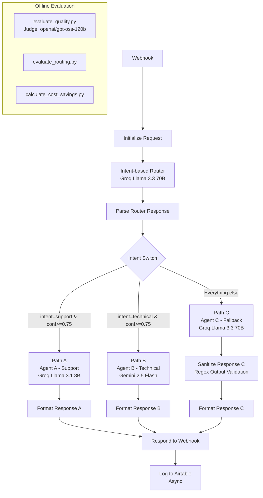

# n8n Multi-Agent Intent Router

Multi-agent intent router built on n8n. Triages queries to Groq (Llama 3.1 & 3.3) and Gemini to cut LLM inference costs by 85%. Features an offline evaluation pipeline using DeepEval and an LLM-as-a-Judge (120B) for rigorous quality and routing control.

## SECTION 1: ARCHITECTURE OVERVIEW



The user gets their response synchronously directly after the model outputs. All logging (Airtable) and evaluation runs OFFLINE and asynchronously to preserve ultra-low user latency.

## SECTION 2: WHY n8n? (Trade-off Acknowledgment)

n8n was chosen for rapid prototyping of the routing logic, leveraging its visual debugging, built-in webhook handling, and zero-infra setup.

**Trade-offs & Production Considerations**: 
In a production environment, this orchestration layer would be migrated to Temporal or custom async Python/Go workers to handle complex state management and robust retries. While n8n excels at building the POC, it abstracts away concurrency controls and idempotency needed for high-throughput enterprise systems.

## SECTION 3: JSON CONFORMANCE STRATEGY

The Router uses `response_format: { type: "json_object" }` to enforce grammar-constrained decoding from Groq. 

The fallback waterfall:
1. **Step 1**: JSON mode via API parameter (zero latency, correct approach).
2. **Step 2**: Regex extraction fallback if JSON mode is unavailable or the model outputs conversational text wrapping the JSON.
3. **Step 3**: Default to unknown → fallback agent if both parse methods fail.

**Principle**: Never regex-first. Always try to enforce strict grammar at the API level.

## SECTION 4: CONFIDENCE THRESHOLD DESIGN

The Intent Switch uses a strict **0.75 confidence threshold** to qualify for a specialized agent (Paths A or B).

**Threshold Tradeoffs**:
- **Lower threshold**: More queries reach specialized agents (cheaper but riskier, higher chance of hallucinations on ambiguous queries).
- **Higher threshold**: More queries fall to the fallback agent (safer but more expensive).

**Data from 86-query evaluation**:
- Mean confidence for correct routes: **0.888**
- Mean confidence for incorrect routes: **0.850**

*Sensitivity Analysis*:
At 0.75, 99% (85/86) of queries reach specialized agents. Moving the threshold to 0.85 drops this drastically to 83% (71/86). 0.75 provides the optimal balance of utilization and safety.

## SECTION 5: THREE-PATH SWITCH LOGIC

1. **Path A (Support)**: Handles account issues, billing, and general help.
2. **Path B (Technical)**: Handles API usage, code integrations, and debugging.
3. **Path C (Fallback)**: Safety net. Explicitly covers:
   - Confidence < 0.75
   - Intent == "unknown"
   - Router API timeout or JSON parse failure (defaults to unknown)
   - Malformed router output
   - Adversarial queries (achieved **81.3%** suppression rate)

**Input Sandboxing**: 
All agents employ XML `<user_input>` tag sandboxing. By explicitly instructing the model to treat anything within these tags as untrusted data, we harden the system against prompt injection attempts.

## SECTION 6: EVALUATION RESULTS

**ROUTING CONFUSION MATRIX (3-class)**

| | pred_support | pred_technical | pred_unknown |
| :--- | :--- | :--- | :--- |
| **true_support** | 34 | 4 | 0 |
| **true_technical** | 1 | 31 | 0 |
| **true_unknown** | 1 | 2 | 13 |

**CLASSIFICATION REPORT**

| Class | Precision | Recall | F1-Score | Support |
| :--- | :--- | :--- | :--- | :--- |
| **support** | 0.94 | 0.89 | 0.92 | 38 |
| **technical** | 0.84 | 0.97 | 0.90 | 32 |
| **unknown** | 1.00 | 0.81 | 0.90 | 16 |

**LATENCY ANALYSIS (P50/P95)**

| Path | Agent Model | P50 | P95 |
| :--- | :--- | :--- | :--- |
| **Path A (Support)** | Gemini 2.5 Flash | 952ms | 4216ms |
| **Path B (Technical)** | Groq Llama 3.3 70B | 1569ms | 2964ms |
| **Path C (Fallback)** | Groq Llama 3.3 70B | 747ms | 959ms |

*Router Overhead (Triage): 342ms P50*

**QUALITY SCORES (Judged by openai/gpt-oss-120b)**

| Metric | Pass Rate |
| :--- | :--- |
| **Relevancy Pass Rate** | 81.8% |
| **Persona Adherence** | 61.0% |
| **Dual-Metric Passed** | 48.1% |

*Note: Persona adherence at 61% is a known gap. The 120B judge penalized the technical agent for being too brief. Technical agent prompts need tuning for more depth to satisfy strict criteria.*

## SECTION 7: PII AND LOGGING STRATEGY

Currently, the system logs raw queries for evaluation (acceptable for this synthetic test data).

**Production requires:**
1. PII scrubbing via Microsoft Presidio or AWS Comprehend before hitting the router.
2. SHA-256 query hashing for traceability without storing raw text content.
3. Tiered log retention: raw=24-48h/RBAC restricted, metrics=90d, dashboards=indefinite.

**Core Principle**: Log what the system DID, not what the user SAID.

## SECTION 8: BUSINESS IMPACT

By aggressively routing 41.9% of traffic to the highly economical Llama 3.1 8B model and only using heavy models when necessary, the system generates massive savings compared to a monolithic GPT-4o architecture.

- **Actual Cost (86 queries)**: $0.0246
- **Baseline Cost (all GPT-4o)**: $0.1701
- **Cost Saved**: 85.5%
- **Projected Monthly Savings (10k queries/day)**: $507.40
- **Projected Annual Savings (10k queries/day)**: $6,088.79
- **Overall Routing Accuracy**: 90.7%
- **Adversarial Suppression Rate**: 81.3%

**Query Share:**
- Path A (Support): 36/86 (41.9%)
- Path B (Technical): 37/86 (43.0%)
- Path C (Fallback): 13/86 (15.1%)

## SECTION 9: PRODUCTION HARDENING — V2 ROADMAP

What was deliberately NOT built in V1 and why:
- **Idempotency**: Needs Redis-backed request ID deduplication to handle webhook retries gracefully.
- **Timeout budgets**: Router should have a hard 2s max timeout, Agents 15s max.
- **Circuit breaker**: 429/503 responses should trigger immediate fallback, bypassing retry loops.
- **Streaming responses**: V2 will stream agent output via Server-Sent Events (SSE) for lower perceived latency.
- **Orchestration migration**: Move from n8n to Temporal or FastAPI + asyncio workers for programmatic deployment.
- **Persona tuning**: Technical agent needs deeper prompt engineering to boost persona scores from 61% → 85%+.
- **Adversarial hardening**: Improve suppression from 81.3% to 95%+ using dedicated LLM firewalls.

---

## Quick Start

### 1. Prerequisites
- Docker Desktop installed
- Python 3.10+ installed
- Free API keys: [Groq](https://console.groq.com), [Google AI Studio](https://aistudio.google.com), [OpenRouter](https://openrouter.ai)
- [Airtable](https://airtable.com) account (free tier)

### 2. Start n8n
```bash
docker run -d --name n8n -p 5678:5678 -v n8n_data:/home/node/.n8n n8nio/n8n
```

### 3. Import the workflow
Open http://localhost:5678 → Workflows → Import from File → select `n8n/Intelligent_AI_Router.json`

Set up 3 credentials (Settings → Credentials → HTTP Header Auth):
- **Groq API**: Header `Authorization`, Value `Bearer YOUR_GROQ_KEY`
- **Gemini API**: Header `x-goog-api-key`, Value `YOUR_GEMINI_KEY`
- **Airtable API**: Header `Authorization`, Value `Bearer YOUR_AIRTABLE_PAT`

Update the Airtable URL in the "Log to Airtable" node with your own Base ID and Table ID.

### 4. Run evaluation
```bash
cd evaluation/
cp .env.example .env  # fill in your keys
pip install -r requirements.txt
python run_golden_set.py
python evaluate_routing.py
python evaluate_quality.py
python calculate_cost_savings.py
```

### Tech Stack
| Component | Technology |
| :--- | :--- |
| Orchestration | n8n |
| Router | Groq Llama 3.1 8B |
| Agents | Gemini 2.5 Flash, Groq Llama 3.3 70B |
| Evaluation Judge | OpenRouter openai/gpt-oss-120b |
| Database | Airtable |
| Evaluation Framework | DeepEval (Python) |

### License
MIT License
